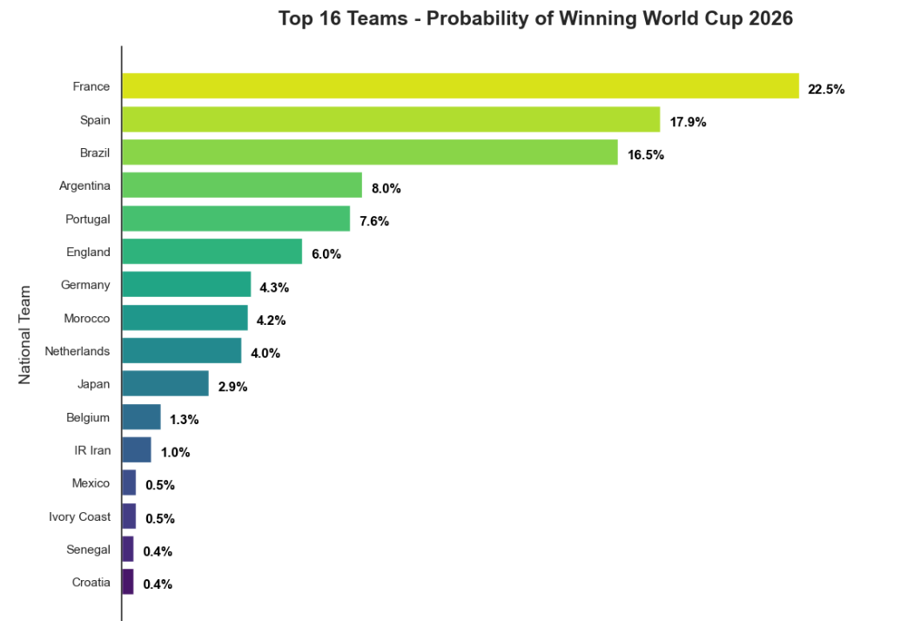
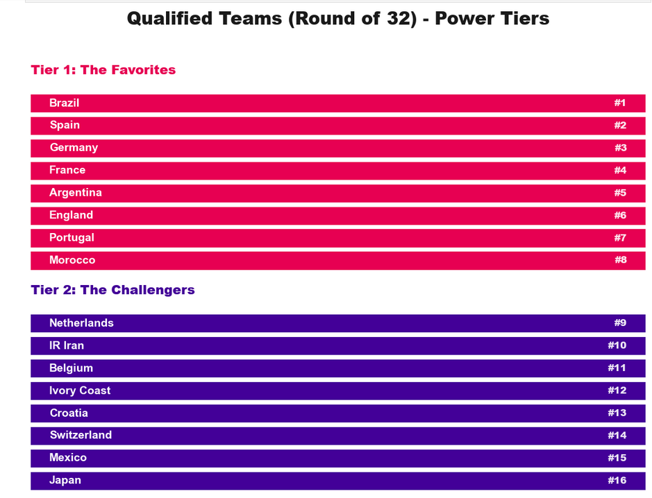
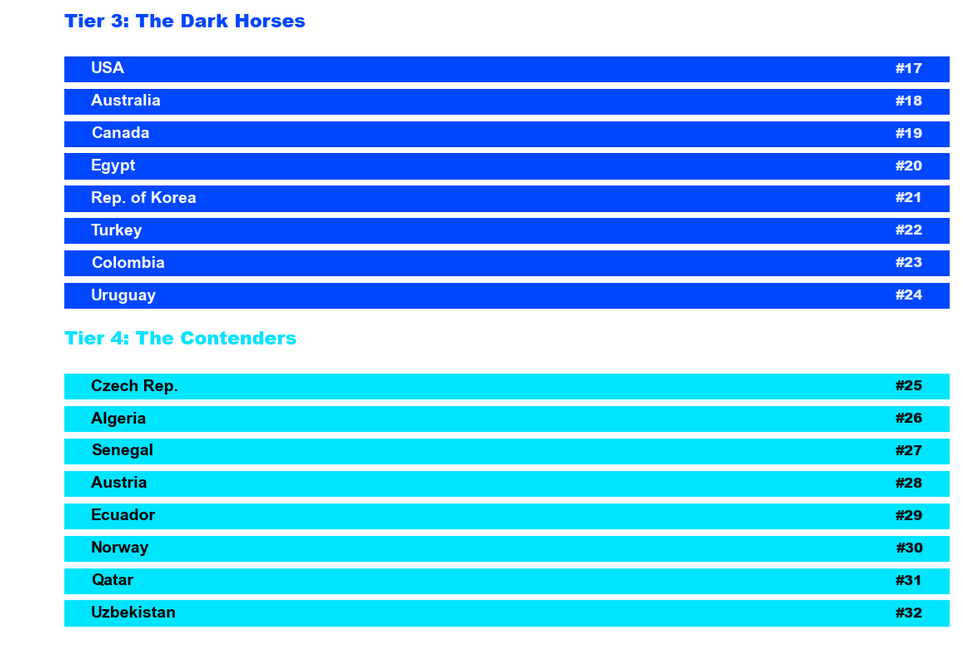
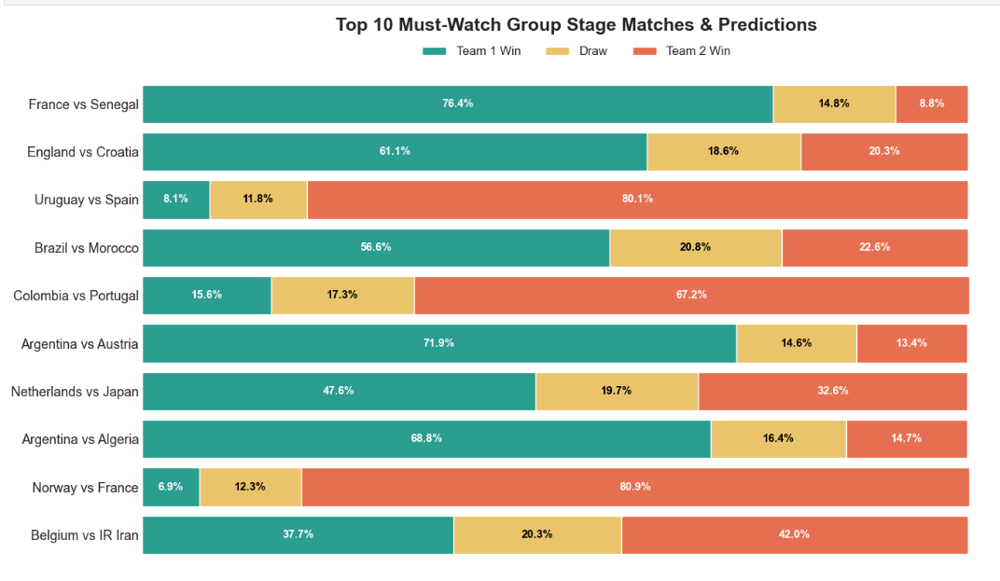
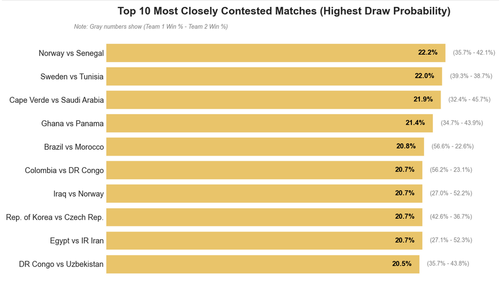

# FIFA World Cup 2026 Prediction Model

**Simulating and Predicting the 2026 World Cup Champion using Statistical Analysis**

---

## About The Project
This project aims to build a comprehensive statistical and mathematical model to simulate the entire trajectory of the 2026 FIFA World Cup, from the group stages to the final match. The model integrates historical international match data since 1994 with current FIFA rankings and recent team form to create a highly accurate prediction engine.

**Key Statistical & Mathematical Techniques Used:**
* **Poisson Distribution:** Utilized to predict match outcomes and probabilities based on Expected Goals (xG) for each team.
* **Monte Carlo Simulation:** Simulating the entire tournament 10,000 times to calculate the precise probabilities of teams advancing through the knockout stages and winning the championship.
* **Time Decay (Recency Weighting):** Assigning exponentially higher weights to more recent matches to accurately reflect a team's current true form.
* **Harmonic Mean:** Applied to calculate a Match "Excitement Score" to mathematically identify the most highly contested and thrilling group stage matches.

---

## Visual Insights & Dashboards

Here are some of the key insights generated by the model after running 10,000 simulations:

### 1. Qualified Teams - Power Tiers
The 32 teams expected to advance past the group stage, categorized into 4 distinct power tiers based on their current form and historical pedigree.

### 2. Top 10 Must-Watch Group Stage Matches
Using the Harmonic Mean, the model identified the most highly contested matches featuring top-tier teams clashing early in the tournament.

### 3. The "Locked" Matches (Highest Draw Probability)
Matches where both teams are mathematically too close to call, resulting in a strict statistical probability of a draw exceeding the win probability of either side.

### 4. Top 16 Champion Contenders
A breakdown of the national teams with the highest statistical probability of lifting the World Cup trophy.

---

## Methodology: How the Model Works

This predictive model wre built using a rigorous data science pipeline, replacing assumptions with pure statistical probabilities. Here is the step-by-step breakdown:

### 1. Data Collection & Preprocessing
The model relies on three primary datasets:
* **Historical International Matches (1994-Present):** Used to extract long-term offensive and defensive capabilities for all national teams.
* **Current FIFA Rankings & Groups:** Contains the official 2026 World Cup group assignments and the current FIFA ranking points for each team.
* **WC26 Match Schedule:** The official template of the 104 matches to be played.
* *Data Cleaning:* We standardized team names across all datasets to ensure perfect joins, handled missing values, and structured the schedule to clearly differentiate between the 72 group stage matches and the knockout rounds.

### 2. Feature Engineering (The Building Blocks)
For every team, we calculated specific metrics to determine their true strength:
* **Historical xG (Expected Goals):** We calculated the average goals scored (Attack Strength) and conceded (Defense Weakness) historically.
* **Recent Form (Time Decay):** We analyzed the last 5 matches for each team. Instead of treating all matches equally, we applied a **Recency Weighting** mechanism (e.g., the most recent match has a 1.5x multiplier, while the 5th match has a 0.5x multiplier) to capture their exact current momentum.
* **World Cup Pedigree:** The World Cup has a unique pressure. We quantified historical World Cup experience to give heavyweights a slight statistical edge, especially in knockout stages and penalty shootouts.

### 3. The Match Prediction Engine
With the features engineered, we predict individual matches using the **Poisson Distribution**:
* The model calculates a final Expected Goals (`xG`) value for both teams by combining their Attack/Defense stats, Form, Pedigree, and FIFA rank differences.
* These `xG` values are fed into the Poisson formula to generate a probability matrix of possible scorelines (e.g., 1-0, 2-1, 0-0).
* We sum the probabilities of all winning, drawing, and losing scorelines to output exact percentage chances. We applied this engine to predict all **72 Group Stage matches**.

### 4. Tournament Simulation (Monte Carlo)
Predicting a single match is not enough for a tournament format. We used a **Monte Carlo Simulation (10,000 iterations)** to play out the entire World Cup:
* **Group Stage:** The model simulates the 72 matches 10,000 times, calculating points and goal differences to rank the 12 groups. It calculates the exact probability of each team advancing as Top 2 or as one of the 8 Best 3rd-place teams.
* **Knockout Stage:** The final 32 teams are placed into a dynamic bracket. The model simulates the knockout matches all the way to the Final to find the ultimate Champion. (Draws in knockout stages trigger a penalty shootout logic weighted by World Cup experience).

---

## Future Work & Model Tuning
To further refine the model and explore different scenarios, future iterations will focus on hyperparameter tuning:
* **Dynamic Recent Form Window:** Expanding the recent form analysis from the last 5 matches to the last 10 or 15 matches to observe how a wider "current form" window impacts the final predictions.
* **Weight Adjustments:** Manually tuning the multipliers for `xG`, `Pedigree`, and `Form` to see how sensitive the model is to historical experience versus current momentum.
* **Player-Level Data Integration:** Factoring in the availability or injuries of key star players to adjust a team's overall xG dynamically before simulations.

---
